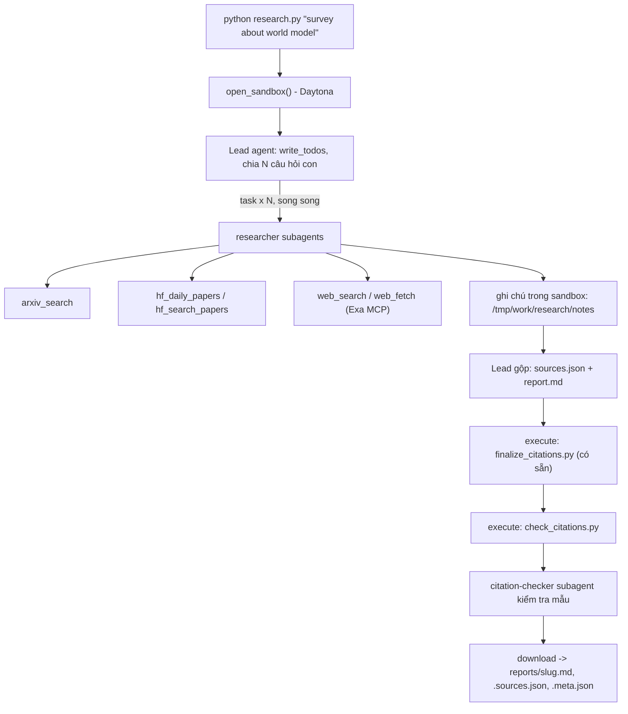

# Deep Research Agent (Deep Agents + Sandbox)

**Bài nộp của Đỗ Thanh Tùng — 2A202602845.** Bản cập nhật ngày 10/10/2026:
đã hoàn tất mã nguồn và **3/5 báo cáo** (World Model, RL reasoning, LLM agents).
Hai báo cáo video/multimodal và efficient inference/small models sẽ được tiếp tục
sau khi quota Gemini được reset. Kiểm tra lại đầu ngày 10/10: lượt chạy agent
vẫn báo hết quota ngày. `self_check.py` hiện báo thiếu hai chủ đề này.
Xem [tiến độ](LAB_PROGRESS.md) và [kiểm chứng trích dẫn](VERIFICATION.md).

Repo nộp bài: [K4-Day23-AdvanceDeepAgents-DoThanhTung-2A202602845](https://github.com/tungne1311/K4-Day23-AdvanceDeepAgents-DoThanhTung-2A202602845).

Lab dựng một **hệ thống deep research đa tác tử**: người dùng chỉ cần nhập một chủ đề (ví dụ `survey about world model`), hệ thống tự lập kế hoạch, giao việc cho nhiều subagent, tìm tài liệu trên arXiv, Hugging Face và web, rồi viết một **báo cáo có trích dẫn**.

Hình thức: **bài thực hành cá nhân**. Ngôn ngữ lập trình: Python 3.11 trở lên.

## 1. Mục tiêu học tập

Sau lab, bạn có thể:

1. Dựng agent bằng thư viện Deep Agents (LangChain): công cụ (tool), system prompt, subagent, backend.
2. Dùng **sandbox** (Daytona) làm không gian làm việc và nơi chạy mã cho agent; hiểu vì sao khóa API và công cụ mạng phải nằm ở phía host chứ không nằm trong sandbox.
3. Viết công cụ gọi API ngoài **chịu được giới hạn tốc độ** (retry, backoff, jitter, `Retry-After`).
4. Thiết kế quy trình đa tác tử: lead chia nhỏ câu hỏi, giao cho N researcher chạy song song, tổng hợp và kiểm tra trích dẫn.
5. Tạo báo cáo có thể kiểm chứng: mọi khẳng định có `[n]` trỏ tới một nguồn có thật.

## 2. Hệ thống làm gì



Nguồn dữ liệu:

| Nguồn | Dùng để |
|---|---|
| arXiv API `https://export.arxiv.org/api/query` | Tìm bài theo từ khóa, sắp theo ngày |
| Hugging Face Daily Papers `/api/daily_papers` | Bài đang "trending": upvotes, githubRepo, summary |
| Hugging Face papers search `/api/papers/search?q=` | Tìm bài theo chủ đề |
| Web qua Exa MCP (`web_search_exa`, `web_fetch_exa`) | Blog, survey, trang dự án, nội dung đầy đủ của một URL |

## 3. Cấu trúc thư mục

```
Lab/
├── README.md  GUIDE.md  RUBRIC.md  REPORT_TEMPLATE.md   tài liệu
├── topics.md                 5 chủ đề cần chạy
├── requirements.txt  .env.example  .gitignore
├── model.py                  CÓ SẴN - không sửa: tạo mô hình LLM từ biến môi trường
├── sandbox.py                CÓ SẴN - không sửa: sandbox Daytona (hoặc Docker), upload, download
├── self_check.py             CÓ SẴN - không sửa: tự kiểm tra trước khi nộp (python self_check.py)
├── finalize_citations.py     CÓ SẴN - không sửa: script chạy trong sandbox, tự sinh `## References` và đánh số lại trích dẫn
├── tools.py                  SINH VIÊN CÀI ĐẶT: retry + 5 công cụ nguồn dữ liệu
├── agents.py                 SINH VIÊN CÀI ĐẶT: prompt, subagent, lead agent
├── research.py               SINH VIÊN CÀI ĐẶT: script chính
├── check_citations.py        SINH VIÊN CÀI ĐẶT: kiểm tra trích dẫn, chạy TRONG sandbox
└── reports/                  báo cáo sinh ra (bạn commit vào repo nộp)
```

Bản khung ban đầu dùng `TODO n` và `raise NotImplementedError`; các TODO trong
bốn tệp sinh viên đã được triển khai. Các script bổ sung: `check_environment.py`
kiểm tra cấu hình, `verify_sandbox.py` kiểm tra sandbox bằng dữ liệu thử,
`run_all.py` chạy lần lượt 5 chủ đề, và `tests/test_lab.py` kiểm tra offline.

## 4. Cài đặt

```bash
python3 -m venv .venv && source .venv/bin/activate      # Python 3.11+
pip install -r requirements.txt
cp .env.example .env                                     # rồi điền khóa CỦA BẠN
```

Bạn cần ba loại khóa (điền vào `.env`, **không bao giờ commit** `.env`):

| Khóa | Lấy ở đâu | Ghi chú |
|---|---|---|
| LLM (`LAB_MODEL` + khóa nhà cung cấp) | Nhà cung cấp bạn chọn (OpenAI, Anthropic, Google, OpenRouter, Ollama...) | Mô hình **phải hỗ trợ tool calling**. Chép tên mô hình từ tài liệu của nhà cung cấp. |
| `DAYTONA_API_KEY` | https://app.daytona.io | Kiểm tra gói miễn phí / credit hiện hành. Không có tài khoản hoặc hết credit: đặt `SANDBOX=docker` để chạy sandbox trong container Docker cục bộ (xem `.env.example`). |
| `EXA_API_KEY` (khuyến nghị) | https://dashboard.exa.ai/api-keys | Có thể chạy không khóa, nhưng bản miễn phí của MCP bị giới hạn tốc độ rất nhanh. |

## 5. Làm bài

### Chạy trên Windows / PowerShell

Mã TODO trong `check_citations.py`, `tools.py`, `agents.py` và `research.py` đã được
triển khai. Các tệp CÓ SẴN được giữ nguyên. Xem `LAB_PROGRESS.md` để biết bước nào
đã kiểm tra và bước nào cần cấu hình riêng trước khi sinh báo cáo.

```powershell
cd E:\K4-Day23-AdvanceDeepAgents-Labs
python -m venv .venv
.\.venv\Scripts\python.exe -m pip install -r requirements.txt
# Chỉ tạo .env khi chưa có, để tránh ghi đè khóa đã điền:
if (!(Test-Path -LiteralPath .env)) { Copy-Item -LiteralPath .env.example -Destination .env }
```

Điền tên model thật và khóa của nhà cung cấp trong `.env`. Nếu dùng endpoint
tương thích OpenAI, cấu hình `LAB_BASE_URL`, `LAB_MODEL`, `LAB_API_KEY`; nếu dùng
provider LangChain, cấu hình `LAB_MODEL=provider:model` và biến khóa tương ứng.
Model phải hỗ trợ tool calling. Không cần activate nếu gọi trực tiếp Python trong
`.venv` như các lệnh bên dưới.

Máy đang được chuẩn bị với `SANDBOX=docker` trong `.env`: cần mở Docker Desktop.
Để chuyển sang Daytona, đặt `SANDBOX=daytona` và điền `DAYTONA_API_KEY`. Exa có thể
chạy bằng endpoint miễn phí; nên điền `EXA_API_KEY` nếu gặp giới hạn tốc độ.

```powershell
# Kiểm tra cấu hình; không gọi LLM và không in giá trị khóa:
.\.venv\Scripts\python.exe check_environment.py
# Kiểm tra offline; không gọi API hay tốn token:
.\.venv\Scripts\python.exe -m unittest discover -s tests -v
# Kiểm tra dữ liệu nguồn thật; không gọi LLM:
.\.venv\Scripts\python.exe tools.py
# Kiểm tra sandbox thật bằng dữ liệu thử, không ghi vào reports/:
.\.venv\Scripts\python.exe verify_sandbox.py
# Chạy thử chủ đề đầu tiên (có dùng token LLM):
.\.venv\Scripts\python.exe research.py "survey about world model"
# Chạy đủ 5 chủ đề; bỏ qua những báo cáo đã đạt kiểm tra tự động:
.\.venv\Scripts\python.exe run_all.py --resume
# Kiểm tra đầu ra trước khi nộp:
.\.venv\Scripts\python.exe self_check.py
```

Trong `reports/`, `.md` là báo cáo tiếng Anh, `.sources.json` là danh mục nguồn,
`.meta.json` là thống kê lần chạy và bằng chứng giao việc/đa nguồn. Báo cáo và
nguồn được lưu nguyên bytes đã tải từ sandbox. Nếu lỗi validator, thiếu nguồn
hoặc thiếu giao việc, chương trình thoát mã 1 và không lưu bộ kết quả mới.
Thống kê token chỉ gồm lead; không phản ánh toàn bộ token của subagent.

Các agent dùng chung giới hạn đầu vào ước lượng `LAB_INPUT_TPM` (mặc định
180.000 token/phút), gồm cả system prompt, lịch sử và schema công cụ. Đây là
ước lượng để giảm lỗi quota, không bảo đảm thay thế bộ đếm chính xác của nhà
cung cấp. Lỗi model tạm thời được retry tối đa 3 lần; lỗi xác thực và thiếu
credit không được retry. Mỗi yêu cầu model có timeout 120 giây.

Nếu lỗi giữa chừng, chương trình lưu ghi chú/bản nháp có sẵn vào
`.runs/<slug>/` rồi vẫn dọn sandbox. Thư mục này được git bỏ qua và không phải
bài nộp. Lần chạy lại cùng chủ đề tự tải dữ liệu đó vào sandbox để agent kiểm
tra và hoàn thiện; các lần gọi subagent cũ không được cộng vào metadata mới.
Chỉ bộ kết quả vượt kiểm tra cuối mới được ghi vào `reports/`.

Làm theo thứ tự (chi tiết trong `GUIDE.md`):

1. `check_citations.py`: khởi động nhẹ, thuần Python.
2. `tools.py`: viết `with_retry` và 5 công cụ. Thử riêng từng công cụ: `python tools.py`.
3. `agents.py`: viết prompt, subagent và lead agent.
4. `research.py`: ghép tất cả; chạy một chủ đề:

```bash
python research.py "survey about world model"
```

Kết quả nằm ở `reports/survey-about-world-model.md` cùng `.sources.json` và `.meta.json`.

## 6. Chủ đề và nộp bài

- Chạy đủ **5 chủ đề** trong [`topics.md`](topics.md), mỗi chủ đề một lần.
- Commit mã nguồn và toàn bộ `reports/`, đẩy lên một **public repo** GitHub và nộp link.
- Kiểm tra trước khi nộp: chạy **`python self_check.py`** (không tốn token): nó kiểm tra đủ 5 báo cáo, `meta.json`, trích dẫn bằng `check_citations.py` của bạn, và không có `.env`/khóa nào trong git.
- Cách chấm: xem [`RUBRIC.md`](RUBRIC.md).

## 7. Thời gian, chi phí và an toàn

- Dùng một mô hình **rẻ nhưng hỗ trợ tool calling**, và **đặt giới hạn** (số lần gọi mô hình/công cụ cho lead và subagent, `recursion_limit`): một prompt hỏng có thể khiến agent lặp rất lâu. Đây là hạng mục 2.5 của `RUBRIC.md`.
- Kết quả có tính ngẫu nhiên: cùng một mã có thể cho báo cáo hợp lệ ở lần này và trích dẫn lỗi ở lần sau. Hãy sửa **prompt và mã**, không sửa tay báo cáo.

- Mỗi lần chạy tốn token LLM và thời gian sandbox. `tokens` trong `meta.json` chỉ đếm tin nhắn của lead, chưa gồm subagent, nên chi phí thật cao hơn. `open_sandbox()` luôn dừng và xóa sandbox khi kết thúc, kể cả khi lỗi. Đừng bỏ qua nó.
- **Không đưa bí mật vào sandbox.** Sandbox không ngăn được prompt injection hay việc đẩy dữ liệu ra mạng; một trang web độc hại có thể khiến agent chạy lệnh bên trong sandbox. Vì vậy mọi công cụ gọi mạng và mọi khóa ở lại phía host.
- Nội dung lấy từ web là **dữ liệu không đáng tin**: agent không được làm theo chỉ dẫn nằm trong đó.
# Kiểm tra nguồn khám phá

Runner ghi URL và nhãn nguồn mà các tool khám phá trả về vào sổ theo dõi ở host
(`provenance.py`). Nguồn cuối phải khớp với tool thực sự trả về URL đó; đổi nhãn
hoặc tự tạo URL tương đương để đủ họ nguồn sẽ bị từ chối. Metadata của lượt chạy
mới chứa `discovered_sources`; `web_fetch` chỉ xác minh nội dung, không đổi nhãn.

Nếu kiểm chứng nội dung phát hiện lỗi sau khi sinh báo cáo, có thể dùng
`python revise_report.py "<topic>" "<review.md>"`. Agent xác minh nguồn và sửa
trong sandbox mới; host tải nguyên bytes đã kiểm tra về. Giữ tập nguồn/provenance
gốc và cộng các lượt gọi/token thực tế vào metadata, có lịch sử `revisions`.
Không sửa tay các tệp báo cáo hoặc chạy finalizer trên host.


## Tiếp tục với nguồn đã kiểm chứng

`prepare_sources.py "<topic>"` gọi các tool khám phá nguồn thật, lưu kết quả gốc
và sổ URL/nhãn trong `.runs/<slug>/`. Script này không viết báo cáo và không gọi
LLM. `research.py` đọc sổ ở host, tải ghi chú vào sandbox và yêu cầu các researcher
kiểm tra bằng chứng trước khi tổng hợp. Những lần giao việc và token của lượt lỗi
không được cộng vào metadata của lượt chạy mới.

Có thể đặt `LAB_CONTEXT_TOKENS` theo context limit đã xác minh của provider để
Deep Agents biết khi nào cần rút gọn lịch sử; không dùng giá trị lớn hơn giới hạn
thực tế. Lỗi quota ngày không được retry như lỗi giới hạn theo phút. Model và
khóa đang dùng được ghi trong `.env` cục bộ, không commit vào repo.
